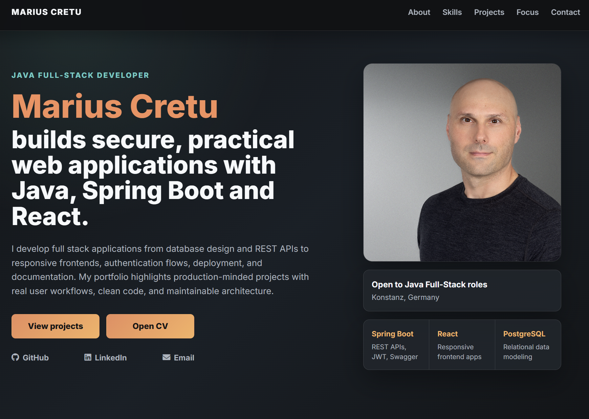

# Marius Cretu — Java Full-Stack Developer Portfolio

Personal developer portfolio showcasing my experience, technical skills, and selected full-stack projects built with **Java, Spring Boot, React, TypeScript, PostgreSQL, and MongoDB**.

The portfolio provides recruiters and hiring managers with quick access to my projects, live applications, source code, professional background, and CV.

## 🌐 Live Portfolio

[View Portfolio](https://cremarnic.github.io/Portfolio/)

## Screenshot



## Features

- Responsive single-page layout for desktop, tablet, and mobile screens.
- Hero section with profile image, Java Full-Stack positioning, CV download, and professional links.
- About section describing full stack delivery and project ownership.
- Skills section covering backend, data, frontend, and delivery.
- Projects section with live demos, GitHub links, project status, proof points, and technologies used.
- Focus section describing where I can contribute on a Java full stack team.
- Contact section with email, phone, location, GitHub, and LinkedIn.
- Smooth scrolling navigation and mobile hamburger menu.
- Lightweight static structure that can be deployed on any static hosting platform.

## Tech stack

- HTML5
- CSS3
- JavaScript
- Google Fonts
- Font Awesome

## Project structure

- `index.html` - main page with all sections and content.
- `styles.css` - styling for layout, typography, responsiveness, and hover states.
- `script.js` - navigation hamburger toggle, smooth scrolling, and navbar styling on scroll.
- `marius-photo.jpg` - profile image used in the hero section.
- `CV - Marius Cretu.pdf` - downloadable CV linked from the hero buttons.

## Running locally

This is a static site with no build step required.

1. Clone or copy the repository files.
2. Open `index.html` directly in your browser.
3. For a local preview that behaves more like GitHub Pages, serve the folder with a static server:

```bash
npx serve -l 8000 .
```

Then open `http://localhost:8000`.

## Deployment

Any static host works (GitHub Pages, Netlify, Vercel, Cloudflare Pages, etc.). Deploy the root folder and ensure all assets stay in the same relative paths.

## Author

**Marius Cretu**

- Portfolio: https://cremarnic.github.io/Portfolio/
- LinkedIn: https://www.linkedin.com/in/marius14cretu
- GitHub: https://github.com/CreMarNic

## Project images

- `images/music-movies-blog.png` - supplied screenshot of About Music in Movies Blog.
- `images/ecommerce-shop.png` - supplied screenshot of Ecommerce Shop.
- `images/fittimer.png` - supplied screenshot of FitTimer.
- `images/task-manager.svg` - Task Manager board illustration.
